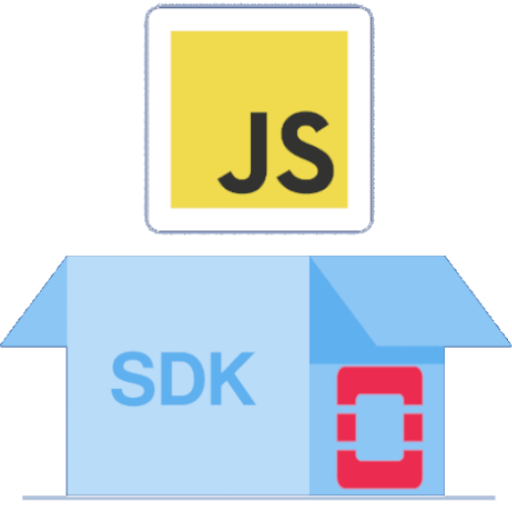

<div align="center">

<h1 >
  <span style="color:#E61742">OpenStack</span>-<span style="color:#F0DB4F">JS</span>-<span style="color:#5FB0EF">SDK</span>
</h1>

This project provides a SDK and an API to interact with the OpenStack Restful API. 
</div>

### Usage

Go on your OpenStack account. Create a new application credentials and download it. Put it in a `clouds.yaml` file and put it in the root of the project.


```bash
# CLone the repository
git clone git@github.com:GridexX/openstack-js-sdk.git
cd openstack-js-sdk
# Copy the environment variables
cp .env.example .env
# Export the variables
export $(cat .env | xargs)
# Install the dependencies and start the server
npm install
npm start
```

> [!IMPORTANT]
> You need to have a `.env` file with the following variables:
> - `OS_CLOUD=openstack`
> - `OS_CLOUDS_FILE=./clouds.yaml`
> - `HURL_host`

### Devlopment

> [!TIP]
> To have a better development experience, you can use the `nodemon` package to automatically restart the server when you make changes to the code. Also, you can pretty print the logs with the `pino-pretty` package.

```bash
npm i -g nodemon pino-pretty
npm run dev:start | pino-pretty
```

### Run in Docker

To run the Docker image, you need to build the image and run it.
By default, the image will expose the port `3000` and use the `/app` directory as the working directory.

To use the `clouds.yaml` file, you need to mount it in the container.

```bash
# Build the image
docker build -t openstack-js-sdk .
# Run the container
docker run -d -p 3000:3000 -v $(pwd)/clouds.yaml:/app/clouds.yaml openstack-js-sdk
```

### Documentation

All the API documentation is available with swagget at `/api-docs` endpoint.
